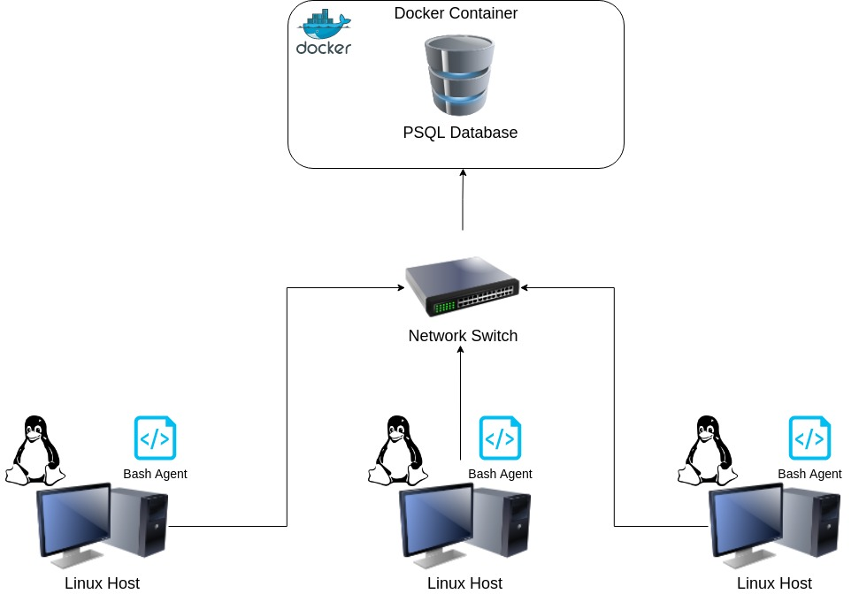

# Linux Cluster Monitoring Agent
This project is under development. Since this project follows the GitFlow, the final work will be merged to the main branch after Team Code Team.

# Introduction
The purpose of the Linux Cluster Monitoring Agent is to assist the Jarvis Linux Cluster Administration team in efficiently managing their assigned Linux cluster, and plan for future changes. To accomplish this, the agent collects and monitors the hardware of each host in the Linux cluster and stores the collected information in a containerized relational database. The minimum viable product consists of various bash scripts to start, and stop the container, collect the hardware specifications of each host to be run once upon installation, and collect hardware usage every minute. The information will be stored in a PostgreSQL database inside a docker container. Pre-made SQL queries are included to answer common business questions. The collected information will be used by the Cluster Administration team to gather insights on the state of the Linux cluster as a whole, and can be used to write reports, and other documents that will be of interest to the LCA manager.

The following technologies were used in the product:
- Linux 
- Google Cloud Platform 
- Bash scripts 
- PostgreSQL 
- Docker 
- IntelliJ 


# Quick Start
The following commands are used in the agent:
- Start a psql instance using `psql_docker.sh`
```
psql_docker.sh start
```
- Stop a psql instance using `psql_docker.sh`
```
psql_docker.sh stop
```
- Create tables using `ddl.sql`
```
psql -h localhost -U postgres -d host_agent -f sql/ddl.sql
```
- Insert hardware specs data into the DB using `host_info.sh`
```
host_info.sh psql_host psql_port db_name psql_user psql_password
```
- Insert hardware usage data into the DB using host_usage.sh
```
host_usage.sh psql_host psql_port db_name psql_user psql_password
```
- Crontab setup
```
crontab -e # Edit crontab jobs
* * * * * bash path/host_usage.sh localhost 5432 host_agent postgres password > /tmp/host_usage.log # Note that the absolute path of the script must be used
```

# Implemenation
To implement the project, Linux virtual machines, using the CentOS distribution were comissioned using Google Cloud Platform. Bash scripts are used to collect hardware information, and usage of each node. For each bash script, hardware information is extracted using commands like `lscpu` and `vmstat` and individual attributes such as total memory are further parsed from the output using `grep` and `awk`. A PostgreSQL database in a Docker container stores all the collected information.
## Architecture


## Scripts
Here are the descriptions of each shell script, and how to use them:
- `psql_docker.sh`: Creates, stops, or starts a docker container depending on the arguments used.
```
#Create a psql docker container. If a container already exists, or a username and password are not given, prints an error messgage
./scripts/psql_docker.sh create db_username db_password

#Starts a docker container. Prints an error message if the container does not exist
./scripts/psql_docker.sh start

#Stops a docker container. Prints an error message of the container does not exist
./scripts/psql_docker.sh stop

```
- `host_info.sh`: Collects hardware information of a Linux node. Ran once upon installation, and inserts the information to the database.
```
./scripts/host_info.sh psql_host psql_port db_name psql_user psql_password
```
- `host_usage.sh`: Collects hardware usage of a Linux node, and inserts the information to the database. To be ran every minute.
```
scripts/host_usage.sh psql_host psql_port db_name psql_user psql_password
```
- `crontab`: Automates the host_usage script to run every minute
- `queries.sql`: Helps solve the followjng business cases:
    - Group hosts by number of CPUs, and sort by memory size in descending order
    - Average memory usage in 5 minute intervals for each host
    - Detect host failure. A failure is defined as less than 3 data points inserted in a 5 minute interval.

## Database Modeling
The PostgreSQl database consists of two tables: host_info, and host_usage. The data schema is described as follows:
- `host_info`

| Column | Data Type | Constraints | Decription |
|----------|-----------|-------------|------------|
|id        |SERIAL     |PRIMARY KEY | id for each host. Auto increments |
|hostname  |VARCHAR    |NOT NULL, UNIQUE | Name of each host |
|cpu_number|INTEGER    |NOT NULL     | Number of CPUs in each host |
|cpu_architecture|VARCHAR|NOT NULL   | CPU architecture |
|cpu_model |VARCHAR    |NOT NULL     | CPU model  |
|cpu_mhz|VARCHAR       |NOT NULL     | CPU speed in mhz |
|l2_cache  |INTEGER    |NOT NULL     | L2 cache   |
|total_mem |INTEGER    |NOT NULL     | total memory of each host |
|timestamp |TIMESTAMP  |NOT NULL     | timestamp when data was inserted. In UTC |
- `host_usage`

| Column | Data Type | Constraints | Decription |
|----------|-----------|-------------|------------|
|timestamp |TIMESTAMP  |NOT NULL     |Timestamp when data was inserted. In UTC|
|host_id   |SERIAL     |FOREIGN KEY  | id for each host. Auto Increments |
|memory_free |INTEGER  |NOT NULL     | Memory free in MB |
|cpu_idle  |INTEGER    |NOT NULL     | CPU idle time |
|cpu_kernel|INTEGER    |NOT NULL     | CPU kernel usage |
|disk_io   |INTEGER    |NOT NULL     | Number of disk I/O |
|disk_available |INTEGER | NOT NULL  | Disk available in MB |

# Test
When testing the bash scripts, I used the -x argument at the end of each script to ensure that the scripts were able to capture each argument, and variable properly. To test if the error messages of each script were working as intended, I ran each script with fewer or more arguments than what is specified. Since extracting variables involved chaining multiple commands together, I ran each chain of commands in isolation as running everything at once would be more cumbersome to debug. Finally, I manually ran each script first before automating them.

For the SQL queries, I inserted test data directly from the psql instance to test if the constraints of each column were working as intended. When looking at the average memory usage, I first wrote a query that displayed the total memory, and memory free, alongside the average memory and did the math manually to make sure the calculation made sense.

All scripts and queries were tested using IntelliJ Idea, and were able to function as planned.

# Deployment
The source code can be found in a GitHub repository, and can be used to view, and comment on changes in the code. The collected data is stored in a PostgreSQL database deployed using a Docker container.

# Improvements
- Writing the bash scripts in a more efficient way
- A graph the visualize the data
- SQL queries to detect when hardware usage is high