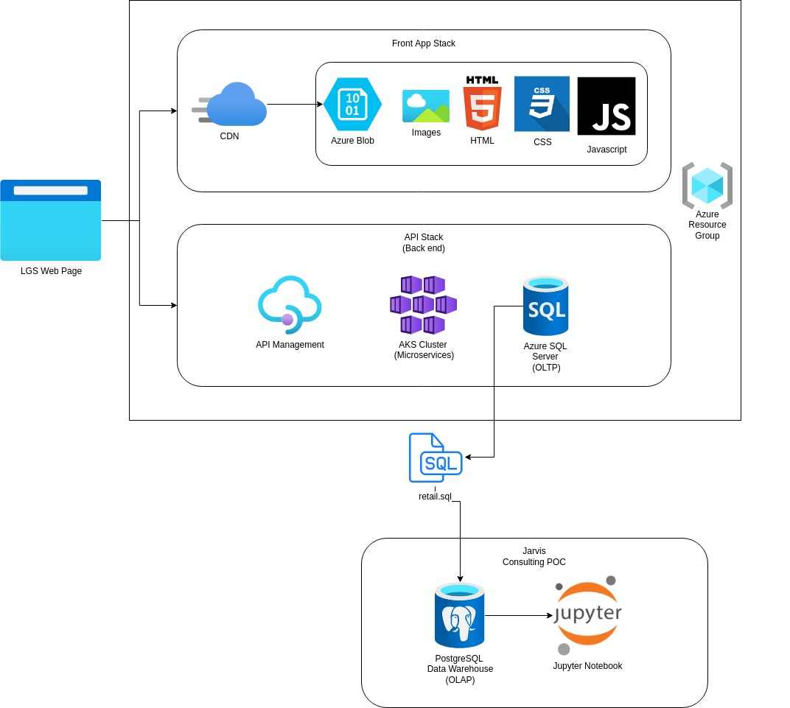

# Introduction
London Gift Shop (LGS) is a UK based online store that sells gift-ware. It's customers mainly consist of wholesalers. Despite being in business for over 10 years, LGS has not seen much of an increase in revenue growth. As LGS lacks the appropriate IT infrastructure, it has partnered with Jarvis Consulting's Data Engineering team to develop a Proof of Concept that will help LGS understand their customers better by analyzing their behaviour. LGS will use the product to plan marketing campaigns to attract new customers, and keep existings ones. 

The product consists of a PostgreSQL data warehouse, that was loaded with transactions from 01/12/2009 to 09/12/2011. To analyze the data and gather insights, the Python programming language, along with libraries such as Pandas, Numpy, and Matplotlib was used. The results of the analysis, as well as graphs are displayed in a Jupyter Notebook.

# Implementation

## Project Architecture
A high level diagram of the architecture is displayed below. The architecture consists of the LGS web application, the data warehouse, and the Jupyter Notebook.

The LGS web application is the point of interaction for users of the product. The front end consists of the Content Delivery Network which is responsible for distributing internet content to different servers worldwide. The files being distributed are HTML, CSS, and JavaScript code as well as images needed to render the website. The files are stored in an Azure Blob. In the backend, the web application is stored in a container maneged by Kubernetes. The service then stores data in an Azure SQL server. 

Since Jarvis is not allowed to access the Azure environment, the transactional data, ranging between 01/12/2009, and 09/12/2011 will be dumped in an SQL file from the Azure SQL server. The data is then loaded into a PostgreSQL database. The data is then analyzed using Jupyter Notebook.

## Data Analytics and Wrangling

Data Analytics can be found [In this Notebook](https://github.com/jarviscanada/jarvis_data_eng_MiguelDario/blob/python_data_analytics/python_data_analytics/python_data_wrangling/retail_data_analytics_wrangling.ipynb)

The transaction data is comprised of the following attributes:
- invoice_no: A unique 6 digit number assinged to each invoice. If an invoice begins with "C" it has been cancelled
- stock_code: A 5 digit number uniquely assigned to each product
- description: The name of the product
- quantity: The quantity of each product per order
- invoice_date: The date of each purchase
- unit_price: Product price per unit in pounds
- customer_id: A unique ID assigned to each customer
- country: The country where the customer resides

Based on the data, the following suggestions can be made to increase revenue:

-  It is clear that most activity happens during the holiday season. LGS should look at ways to stimulate activity during off peak seasons. In addition, sales growth tends to be negative during the off peak seasons.
- From 2011 onwards, the number of new users is less than that of previous years, and the vast majority of activity comes from existing users. LGS sould look at ways to attract new users through marketing campaigns or new user promotions.

After conducting an RFM analysis, LGS should focus on the following customer segments: 

- Cannot lose: These customers have not made a purchase recently, but have purchased in large amounts. Perhaps they may have purchased from a competitor that meets their needs better. A personalized discount or gift program should be able to win these customers back
- Hibernating: These customers have not made any purchases in a long time. Discount programs may entice them to purchase with LGS once more.
- Champions: These customers make up a big chunk of revenue and should be prioritized in terms of customer retention. Continuing to run campaigns should be able to retain these crucial customers.
# Improvements
- Total Sales by country, and a pie chart to visualize, so that LGS can better allocate its inventory for each country/continent
- A machine learning model to predict future purchasing trends in order to plan ahead for the future
- Longer period of data available which will give a more accurate picture of LGS's activity